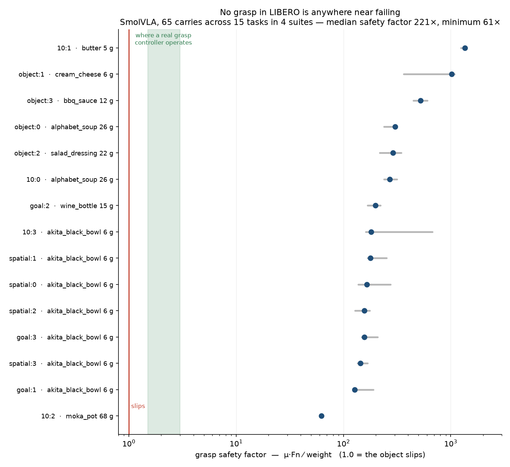
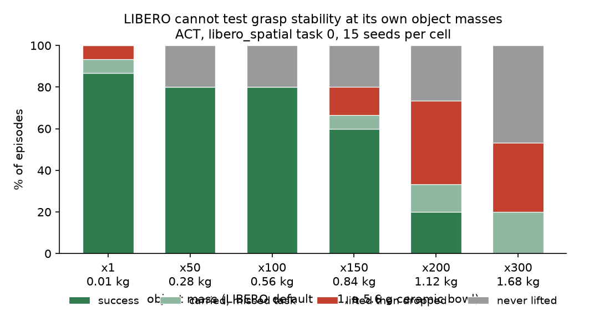
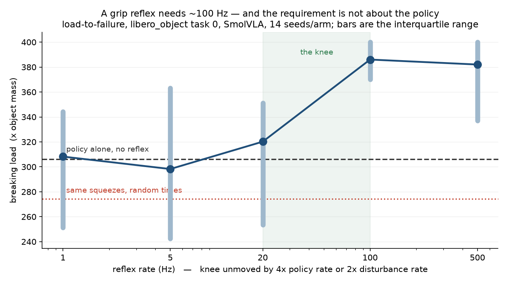

# ReflexArc

**A chunked manipulation policy is blind for up to a second at a time. When the object starts to slip inside that window, is the fix a faster brain or a dumber, faster spinal cord?**

Built on [LIBERO](https://libero-project.github.io/) and [LeRobot](https://github.com/huggingface/lerobot), on a laptop, no CUDA. Sibling to [Faultline](../RoboticsResearch), which measures what a benchmark score hides; this one measures what a benchmark cannot test at all.

| | |
|---|---|
| **[Findings log](docs/FINDINGS.md)** | every claim with its status, including one that an artifact nearly sold me |
| **[Reproducing](#reproducing)** | one command per figure |

---

## The question

Action chunking is how nearly every modern VLA runs: the policy emits 20–50 actions and the robot executes them open-loop before re-inferring. At LIBERO's 20 Hz that is 1–2.5 seconds during which the policy's decision is frozen. If something physical goes wrong inside that window, the policy cannot respond to it, because it is not looking.

The literature's answer is to make cognition faster — [real-time chunking](https://arxiv.org/abs/2506.07339), [latent world-model switching](https://arxiv.org/html/2606.18589), [interleaved correction](https://arxiv.org/pdf/2509.23224). Biology's answer is different: a spinal reflex arc responds in 20–50 ms without consulting anything that could be called a decision.

This asks which one the failure actually needs, by bolting a hand-written reflex onto a frozen off-the-shelf policy and controlling for every way that could look like it worked when it didn't.

## Result 1 — no grasp in LIBERO is anywhere near failing



The **grasp safety factor** is the tangential load a contact can carry before sliding, over the object's weight: `S = µ(Fn_left + Fn_right) / mg`. At S = 1 the object slips. Grasp controllers, biological and robotic, are usually described as operating around 1.5–3.

Across **65 carries in 15 tasks spanning all four LIBERO suites**, the median is **221** and the minimum is **61**. Not one carry in 65 falls below 3.

Two causes stack. The objects are 10–100× lighter than the things they depict — a wine bottle at 15 g, a moka pot at 68 g, a can of soup at 26 g. And the gripper closes far harder than the task needs: 34–40 N of normal force on `libero_object`'s boxes and cans, holding objects that weigh under a fifth of a newton.

A benchmark whose grasps sit two orders of magnitude inside the friction cone cannot score a policy on whether it holds on. Nothing a policy does to the grasp is measurable, so nothing in the reported number reflects grasp quality.

### The same thing, as a degradation curve



The akita black bowl of `libero_spatial` task 0 has a mass of **5.6 grams**. Measured grip normal force during a carry is 1.8–4.9 N against a finger friction coefficient of 1–2, so the friction-cone ratio |Ft| / (µ|Fn|) — which reaches 1.0 at the point of sliding — sits at about **0.08**.

Nothing the policy does can lose that object. No part of the benchmark score depends on holding on to it.

Scaling every free object's mass and holding everything else fixed, that changes: at ×200 the bowl weighs 1.12 kg and 40% of episodes lift the object and then drop it. This is the operating point every experiment below uses.

Mass is worth singling out among perturbation axes because **it is the only one that leaves the observation untouched**. Camera shift, lighting, texture, blur and instruction corruption all break a policy by corrupting its input. A mass change leaves every pixel identical and alters only what the world does — the policy's plan was right and the world was different. It is not strictly unobservable, since a loaded arm tracks its commands differently and that reaches proprioception, but that is the same channel a human has.

## Result 2 — the grasp is not where the tactile sensor would be

Real tactile hardware sits on the fingertip. The Panda model has separate collision geoms for the finger shaft and the pad, so which one carries the load is measurable.

With **ACT** on `libero_spatial` task 0, every load-bearing contact during a successful carry is on the **shafts**. The pads touch for a single step during closure and then separate. The bowl rim wedges between the fingers rather than being pinched by their tips. The first sensor model written here read only the pads, and reported zero contact for an entire successful episode that lifted the bowl 103 mm and completed the task.

But it is not a property of the task. Share of grip force borne by the pads during the carry, SmolVLA, 4 seeds per cell:

| suite | task 0 | task 1 | task 2 | task 3 |
|---|---|---|---|---|
| `libero_spatial` | 0.68 | 0.69 | 0.74 | 0.91 |
| `libero_object` | **0.99** | **0.98** | **0.94** | **0.99** |

SmolVLA pinches with the pads on the same task and object where ACT wedges on the shafts, and `libero_object`'s boxes and cans give near-pure fingertip grasps throughout.

So "add tactile sensing to this benchmark" is not a well-posed instruction: where the sensor should go depends on which policy is holding the object.

## Result 3 — the fingertip knows *which* grasps fail, not *when*

31 drop episodes and 29 hold episodes, pooled across mass ×150 and ×200. Step-level discrimination between "a drop follows within 500 ms" and "an ordinary step of a marginal carry":

| channel | AUC |
|---|---|
| `cone_ratio` — friction-cone margin | 0.668 |
| `fn` — grip normal force | 0.654 |
| `d_cone` | 0.628 |
| `ft` — tangential force | 0.568 |
| `pad_fraction` | 0.542 |
| `d_fn` — force collapse rate | 0.508 |

The best measurable channel reaches 0.67. Force magnitude reports that the grasp is loaded near its friction limit, which at this mass is true of nearly every episode including the successes.

**An episode-level analysis of the same data looked far better and was an artifact.** A threshold on `d_fn` detected 21 of 22 drops with a median lead of 19 control steps — 950 ms of warning. But a carry at this mass lasts only 13–22 steps, so a lead of 19 means the detector fires at the moment of lift and never stops; its false-alarm rate was 43%, on seven negatives. High recall from a detector that is simply always on.

One channel survives, and it is not a force. `pad_fraction`, the share of load borne by the fingertips rather than the shafts, catches **26 of 31 drops** at under 20% false alarm with a median lead of **3 control steps (150 ms)**. The mechanism is legible from Result 2: these grasps begin as a shaft wedge, and when the object slides down into a fingertip-only pinch it is about to be gone.

Two things follow. A single force reading per finger cannot express this — it needs enough spatial resolution to distinguish shaft contact from tip contact, which is an argument for taxel arrays over load cells derived from a failure prediction rather than from first principles. And 150 ms is longer than one control step (50 ms) and far shorter than one action chunk (1000 ms): the one window where only a sub-policy loop is fast enough to act.

## Result 4 — one arm works, and the control shows the sensing did nothing

Five arms at mass ×200, 30 seeds each, identical seeds and initial states.

| arm | success | dropped | never lifted | p vs policy |
|---|---|---|---|---|
| policy alone | 5/30 | 17 | 8 | — |
| + reflex, freeze the arm | 5/30 | 5 | **17** | 1.000 |
| + reflex, force gripper closed | 6/30 | 16 | 8 | 1.000 |
| + reflex, **servo gain ×6** | **20/30** | 4 | 6 | **0.0000** |
| servo gain ×6, **timing shuffled** | **18/30** | 4 | 8 | **0.001** |

**The arm-arrest reflex cuts drops from 17 to 5 and helps nobody.** Never-lifted rises from 8 to 17 and success does not move: it prevents drops by preventing the lift. Reported as "drops reduced 70%" this would look like a result; it is a robot that stopped doing the task.

**Only the intervention outside the action space works.** Forcing the gripper command closed — something any policy could already request — does nothing (6/30 against 5/30). Raising the finger servo gain six-fold takes success to 20/30. The authority exists in the hardware, is unreachable through LIBERO's binary gripper command, and no policy trained on this benchmark could learn to ask for it.

**And the tactile signal contributed nothing.** The timing-shuffled control fires the same boost the same number of times per seed, at moments drawn without consulting the sensor. It scores 18/30 with the same 4 drops. Sensed and blind are indistinguishable.

So the honest reading of the only positive result here is: *the gripper was under-powered for the object, and giving it more force fixes the task.* When the reflex fired did not matter. What it was responding to did not matter.

That is what the yoked control is for. Without it, this table reads "a tactile reflex quadruples manipulation success," and that is false.

*Two arms were withdrawn from this table after they produced results that could not be physical: an always-on boost, and a sweep of continuous gains, all scoring exactly 0/30 with every episode never lifting across a four-fold gain range. Both inherited the force-close behaviour and so welded the gripper shut for the entire episode. [FINDINGS F4a](docs/FINDINGS.md).*

## Result 5 — chunk blindness is not what loses the object

The premise of the whole project is that a disturbance landing inside an open-loop chunk cannot be answered by the policy. Measured at ×200, 20 seeds per cell:

| chunk | open-loop | success | dropped |
|---|---|---|---|
| 5 | 250 ms | 1/20 | 8 |
| 10 | 500 ms | 0/20 | 10 |
| 20 | 1000 ms | 4/20 | 11 |
| 50 | 2500 ms | **10/20** | **4** |

The relationship runs the wrong way. Committing to 2.5 seconds of open-loop execution is the best setting tested; replanning five times more often is the worst. Under a dynamics perturbation the policy's corrections are worse than no corrections — it sees a scene whose appearance is unchanged and whose dynamics are not, and steers accordingly.

`Faultline`'s F2 measured the opposite ordering on the same task at nominal mass, where n=50 was the worst setting and cost 27 points. The reversal is the point: chunk length interacts with the disturbance, and "replan more often" is not a safe default.

## Result 6 — LIBERO grasps do not slip in transport

Everything above measures a reflex against failures that were never slip. The check that settles it: drive the effective friction coefficient to **0.04** — a 50× reduction, a pinch on something about as slick as wet ice — on the suite whose grasps are true fingertip pinches.

| arm | success | dropped | never lifted |
|---|---|---|---|
| policy alone | 29/40 | **1** | 10 |
| grip ×6 @ 500 Hz | 26/40 | **0** | 14 |

One drop in forty. Lowering friction stops the gripper *acquiring* the object; it does not make it lose one.

Pooled across all 1,292 rollouts run for this project:

| suite | rollouts | lifted then dropped |
|---|---|---|
| `libero_object` — pinch, friction ×0.02, impulses to 16 N | 280 | **12 (4%)** |
| `libero_spatial` — wedge, mass to ×300 | ~800 | ~300 (38%) |

The only regime producing in-transport loss is the one where a rim is wedged between the finger shafts carrying an object 200× heavier than specified, losing its *geometry* rather than sliding — a 64 N lateral tug dislodges it 4 times in 12.

**LIBERO cannot host a tactile slip-reflex experiment.** Not for want of trying the right disturbance — mass, friction and a timed external wrench, two suites, two policies, 1,292 episodes — but because the carry phase is not where these grasps fail. Failures live at closure, before a stable grasp exists, which is grasp selection rather than anything a reflex can reach.

## Result 7 — the reflex does work, and the rate it needs is set by the contact



Every result above measured a bit per rollout — at a fixed load, did it drop — which needs the load tuned into a narrow band and, at n=25, can only see a swing of about twenty points. This ramps the load instead and records **where the grasp broke**: a continuous number per rollout, no calibration, and episodes that never break are censored rather than discarded. Pre-registered in [docs/PREREGISTRATION.md](docs/PREREGISTRATION.md), with two amendments logged from policy-only pilots.

| arm | median breaking load | p (Holm) |
|---|---|---|
| policy alone | 312 | — |
| reflex @ 1 Hz | 300 | 1.000 |
| reflex @ 5 Hz | 316 | 1.000 |
| reflex @ 20 Hz | 320 | 1.000 |
| **reflex @ 100 Hz** | **392** | **0.0064** |
| **reflex @ 500 Hz** | **376** | **0.0298** |
| oracle (true load) | 372 | 0.0428 |
| **yoked** (same budget, blind timing) | **288** | 1.000 |

Paired by seed, 100 Hz beats the policy on **11 of 14 seeds** (median +82) and the yoked arm on 7 of 14 (median +0).

Three things follow. A grip reflex is worth roughly **25% more load**. It needs about **100 Hz** — at 20 Hz it is worth nothing. And the **timing is the entire effect**: the yoked arm squeezes the same number of times for the same duration at moments drawn without the sensor, and lands at or below baseline.

**But the rate requirement is not about the policy.** That was this project's first reading and it was wrong. Varying the two candidate drivers independently, the knee does not move: doubling the disturbance rate should have pushed it to ~200 Hz, quadrupling the policy's replan rate should have pushed it to ~400 Hz, and in both the same thing happens in the same place — 20 Hz worthless, 100 Hz works ([F12](docs/FINDINGS.md)).

That reads as a property of the contact rather than of the control stack, and it is the stronger version of the claim: if the rate were set by the policy, a fast enough policy would remove the need for a reflex. If it is set by the physics, nothing above it substitutes for a fast loop.

## So: is the fix a faster brain or a faster spinal cord?

On this benchmark the question cannot be asked, and finding that out took every experiment above. Four things stand in the way, and they are different in kind:

1. **There is no slip to react to.** Across 280 rollouts on friction grasps at 50× reduced friction, 4% of episodes lose the object in transport (Result 6).
2. **The window isn't the problem.** Longer open-loop chunks are *better*, so the policy being blind is not what loses the object (Result 5).
3. **The signal doesn't carry the timing.** No fingertip channel separates an imminent drop from an ordinary marginal grasp above AUC 0.67, and the detector that looked good was reporting a grasp that had already half-failed (Result 3).
4. **When an intervention does work, neither sensing nor speed is why.** A blind timing-shuffled control matches the tactile one, and a 500 Hz loop matches a 20 Hz one (Results 4 and 5b).

What is left is a claim about hardware rather than about architecture. The only intervention that helped was raising the finger servo gain, and the control that keeps everything else and removes just the boost falls straight back to baseline (6/30 vs 5/30). The limiting factor was grip force — an authority present in the actuator, absent from the action space, and impossible for any policy trained on this benchmark to request.

For a reflex to be worth having, four things must hold: the failure must exist, it must happen inside the blind window, the sensor must say *when*, and the response must be one the interface can deliver. Here none of them did — and the first one failing is why the rest were never really on trial.

Two questions I would now put to someone who builds hands:

**If the action interface cannot express grip force, what is a tactile sensor on that hand for?** Every reflex reachable through LIBERO's action space either did nothing or stopped the robot. The only thing that worked reached past the interface entirely.

**If the benchmarks we train manipulation policies on cannot drop anything, what have those policies learned about holding on?** A 5.6 g object at a friction-cone ratio of 0.08 does not require a grasp so much as a gesture.

## What a fair test would need

Nothing here rules the reflex hypothesis out. It rules out testing it in this simulator, which is a smaller and more actionable claim:

- **A grasp that can slide.** Deformable or textured contact, not a rigid rim in a rigid wedge. MuJoCo's convex soft-contact solver is the wrong tool.
- **Commandable grip force.** A gripper interface exposing force, not a binary open/close — which real Panda firmware has and this action space discards.
- **Objects with plausible mass and friction**, so the safety factor sits near 1.5 rather than 65.
- **A disturbance during transport**, since that is the only phase a carry reflex can act in.

The cheapest venue meeting all four is probably real hardware with a cheap slip sensor, which is where the original brief started.

## Method notes worth stating

**Outcomes, not a success rate.** A reflex that freezes the arm converts drops into timeouts, which moves no success rate while changing the failure entirely. Every result splits into `never_lifted` (a floor effect of the mass setting, not addressable by a grasp reflex), `lifted_lost` (the only failure a reflex could prevent), `carried_missed`, and `success`.

**The yoked control.** The obvious control for "the reflex helped" is an arm that always intervenes, but that changes two things at once and a robot that crawls fails on the step limit for unrelated reasons. Instead, each seed's control arm intervenes for the *same number of steps* the tactile arm used on that seed, at times drawn without the sensor. If it recovers as many drops, the benefit was intervening, not sensing.

**The oracle is quarantined.** In simulation it is trivial to build a slip detector no hardware could match, and equally easy to do it by accident. Physically unmeasurable channels are named `oracle_*` and are excluded from every detector; they appear only as the bound a measurable signal competes against.

**The reflex cannot do the textbook thing.** `PandaGripper.format_action` maps the gripper command to binary open/close, so "detect slip, increase grip force" — what real slip controllers do — is not expressible through LIBERO's action space. The `squeeze` arm reaches past the interface and raises the finger servo gain directly (measured: peak grip force 18.3 N → 33.4 N). It is deliberately not a fair policy; it is the control that separates *no useful signal* from *a signal with no way to act on it*.

## What is and isn't new here

| | status |
|---|---|
| A slow policy + fast tactile loop beats visual-only imitation | **prior art** — [Reactive Diffusion Policy](https://arxiv.org/abs/2503.02881), RSS 2025, which frames chunk blindness in nearly these words |
| Chunk execution is brittle to disturbance; fix it with faster inference | **prior art** — [RTC](https://arxiv.org/abs/2506.07339), [DREAM-Chunk](https://arxiv.org/html/2606.18589), [TIDAL](https://arxiv.org/pdf/2601.14945) |
| Sub-50 ms tactile slip reflexes are achievable on real hardware | **prior art** — [Reactive Slip Control](https://arxiv.org/abs/2602.16127), [FORTE](https://arxiv.org/html/2506.18960v2) |
| VLA robustness to physical/dynamics perturbation | **partly covered** — [COLOSSEUM V2](https://arxiv.org/pdf/2605.27759), [LIBERO-Safety](https://arxiv.org/pdf/2606.23686); [LIBERO-Plus](https://arxiv.org/abs/2510.13626) is visual/state/language only |
| **LIBERO's object masses make grasp stability untestable** | not found in the literature; quantified here |
| **Which part of the gripper carries the load is policy-dependent** | not found in the literature |
| **Contact location predicts drops where contact force does not** | not found for VLAs; consistent with the tactile-sensing literature's case for spatial resolution |

Not a new method. A measurement of whether a reflex is the right answer to a specific failure, with the controls that make the answer trustworthy either way.

## Limits

- One task (`libero_spatial` task 0), one policy for everything quantitative (ACT), one simulator. The cross-suite survey is 4 seeds per cell and SmolVLA only.
- 30 seeds per arm. A 15-point difference is not detectable at this n; absent effects are weak evidence, present ones are large.
- MuJoCo's soft-contact solver is not a high-fidelity model of slip. This measures where a fast loop belongs in the stack, not what real slip does.
- The mass perturbation puts the policy out of distribution with respect to its training data. That is what a perturbation is, but it means the drops are not evidence about how these policies behave in deployment.
- `pad_fraction`'s threshold was chosen after seeing the data, on one task. It needs a held-out check before it is more than a hypothesis.
- The `oracle_slip_speed` channel in the collected traces differenced two coordinate frames and its sub-chance AUC should not be read as a physical claim. Fixed in `sense.py`; traces predate the fix.

## Open questions

1. **Does the reflex fail for lack of signal or lack of authority?** The `squeeze` arm is the test, and it is the one whose answer generalises: if grip force recovers drops that arm-arrest cannot, the limiting factor is the action interface, which is a statement about how robots should be built rather than about how policies should be trained.
2. **Does `pad_fraction` hold up on `libero_object`,** where grasps are true fingertip pinches and the shaft-to-tip migration this signal detects cannot happen the same way?
3. **Why is a wedge grasp the thing ACT learned?** It is more robust to the mass perturbation than a pinch would be, which no part of its training rewarded.
4. **Does the chunk length matter at all here?** The ladder is built but unrun. If policy-only success is flat in `n_action_steps` under this disturbance, then chunk blindness is not what loses the object and the reflex framing is wrong for this failure mode regardless of the sensing.
5. **Does any of this survive a real gripper?** Everything is MuJoCo, and the finding that most load rides on the finger shafts may be an artifact of the collision model rather than a fact about Panda hardware.

## Reproducing

Uses the environment built by the sibling `RoboticsResearch/scripts/setup_macos.sh`:

```bash
VENV=../RoboticsResearch/.venv/bin/python

# Result 1: mass ladder
PYTHONPATH=src $VENV experiments/calibrate.py --axis mass \
  --values 1,50,100,150,200,300 --seeds 15 --out runs/calib_mass

# Result 2: where the grasp loads the gripper
PYTHONPATH=src $VENV experiments/grasp_survey.py --seeds 4

# Result 3: traces, then detectability
PYTHONPATH=src $VENV experiments/collect_traces.py --mass 200 --seeds 40 --out runs/traces_m200
PYTHONPATH=src $VENV experiments/detect_roc.py --dirs runs/traces_m150 runs/traces_m200

# Result 4: the arms. --no-contact-gate matters -- with the gate on, the
# detector fires in 5 of 30 episodes and the comparison is vacuous.
PYTHONPATH=src $VENV experiments/arms.py --mass 200 --seeds 30 \
  --channel pad_fraction --threshold 0.97 --comparison gt \
  --hold-steps 6 --arrest-gain 0.0 --force-gain 6.0 --no-contact-gate \
  --arms policy,reflex,squeeze,yoked_squeeze --out runs/arms_ungated

# the control that decides what the squeeze arm proved
PYTHONPATH=src $VENV experiments/arms.py --mass 200 --seeds 30 \
  --channel pad_fraction --threshold 0.97 --comparison gt \
  --hold-steps 6 --force-gain 1.0 --no-contact-gate \
  --arms squeeze --out runs/closeonly

# Result 5: chunk length
PYTHONPATH=src $VENV experiments/ladder.py --mass 200 --seeds 20 \
  --ladder 5,10,20,50 --arms policy --out runs/ladder

PYTHONPATH=src $VENV experiments/figures.py --arms runs/arms_ungated
$VENV -m pytest -q                  # 23 unit + 5 simulator regressions
```

Every trial is determined by `(suite, task, mass, impulse, arm, seed)`. Sweeps append to `trials.jsonl` keyed by that tuple, so an interrupted run resumes and a partial run stays analyzable.

## Architecture

```
src/reflexarc/
  sense.py     fingertip sensor model; oracle channels quarantined by name
  disturb.py   mass, finger friction, and a grasp-triggered external wrench
  reflex.py    SlipReflex / SqueezeReflex / ScheduledReflex (yoked control)
  runner.py    one rollout with three injection points
  stats.py     Wilson intervals, Fisher exact
```

The rollout loop exposes exactly three places to intervene, and the asymmetry between two of them is the whole experiment:

```
read tactile          <- what a fingertip knows at time t
policy.select_action  <- refreshed only every n_action_steps
reflex                <- re-decides every step, sees only the tactile reading
impulse.update        <- the world, doing something unplanned
env.step
```

Environment and policy construction is adapted from `Faultline`, which established the parts of this stack that fail silently rather than loudly: camera-key mapping derived from the checkpoint, `init_state_id` pinned to the seed, and global RNG seeding before construction.
